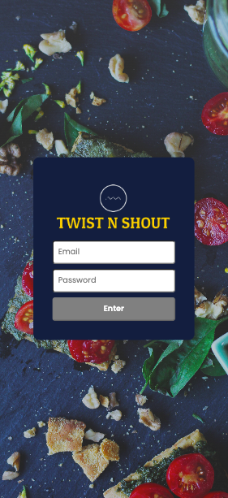
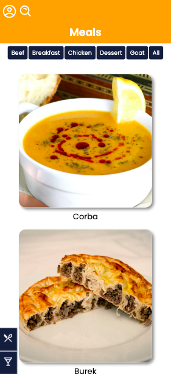
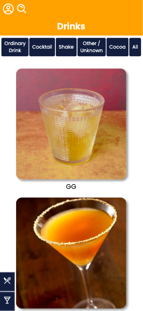
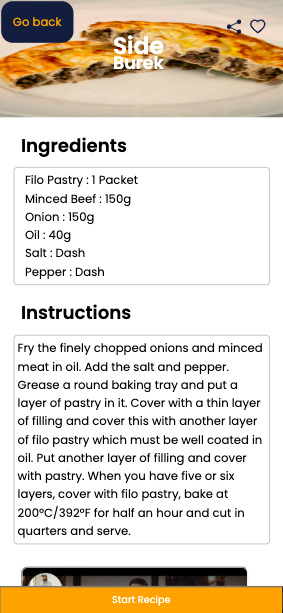
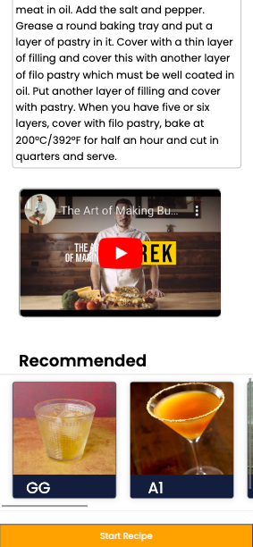
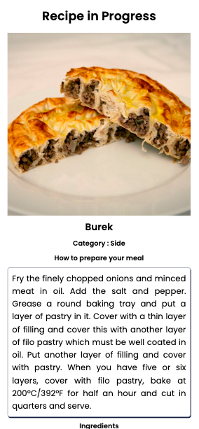
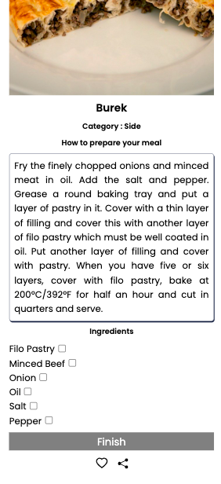
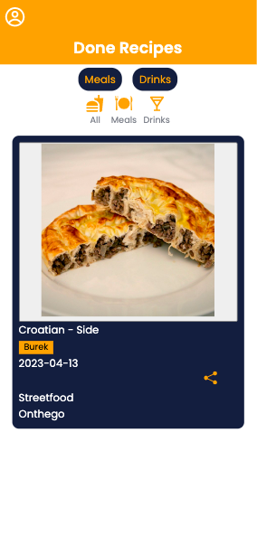
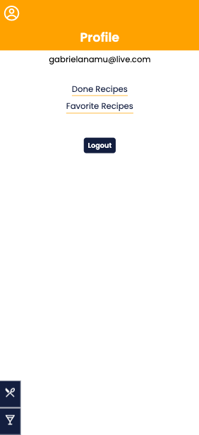

# Recipes APP / [Demo](https://gabinamu.github.io/recipes-app)

Recipes APP, as the name already says, is a recipe app developed using the most modern within the React ecosystem: Hooks and Context API! This application is capable of:

- View, search, filter, bookmark, and track the cooking progress of food and drink recipes!
- The database will be 2 different APIs, one for food and one for drinks;
- The layout focuses on mobile devices, so all prototypes will be developed on smaller screens.

<div align="center" display="inline">









</div>

## Run locally:
- First clone the repository into your machine

```
git clone git@github.com:GabiNamu/recipes-app.git
```

- Go to the project directory
```
cd recipes-app
```

- Install dependencies

```
npm install
```
- Start the server
```
npm start
```
## Run the Tests:
- Use the below command inside your project directory
```
npm test
```
## Authors:
 - [@GabiNamu](https://www.github.com/GabiNamu)
 - [@carlospsvieira](https://github.com/carlospsvieira)
 - [@gabrielaguiardantas](https://github.com/gabrielaguiardantas)
 - [@Rguimaraesgp-dev](https://github.com/guimaraesgp-dev)

## Main technologies used:
- React;
- React Router;
- API request;
- JavaScript;
- Context-API;
- Hooks;
- Css;
